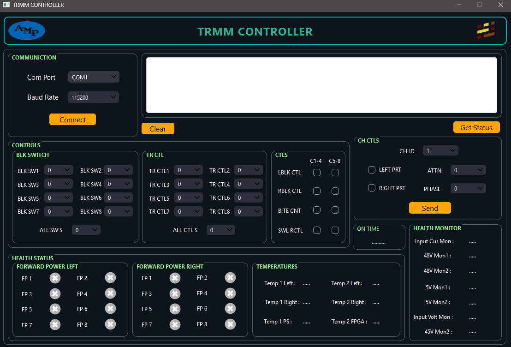

📡 TRM RND CONTROLLER:

    This is a Python GUI application built with PySide6 (Qt for Python) to control and monitor a Transmit/Receive Module (TRM) over a serial connection.

⚙️ Tech stack:

    •	Python 3.13
    •	PySide6 (Qt for Python)
    •	PySerial
    •	QThread & Signal/Slot for non-blocking serial communication
